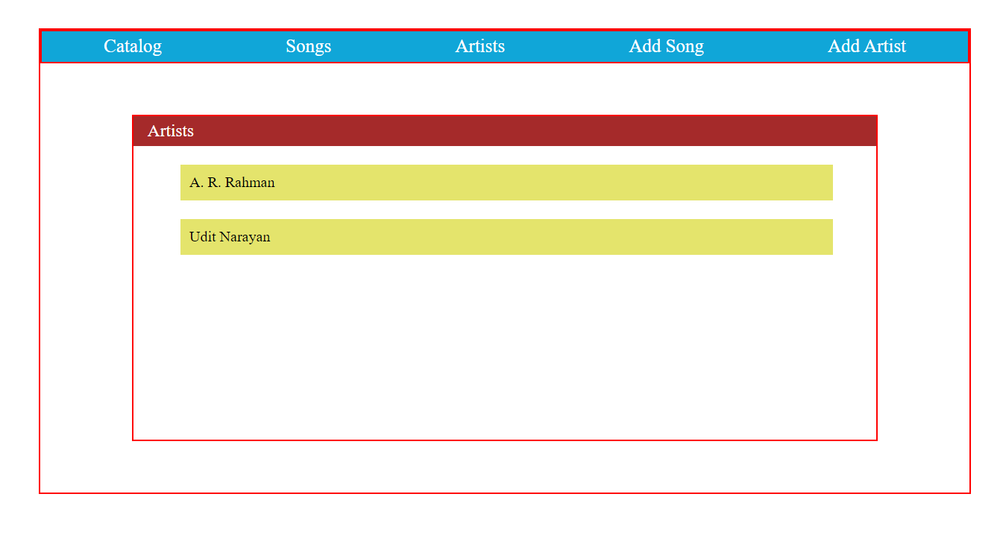
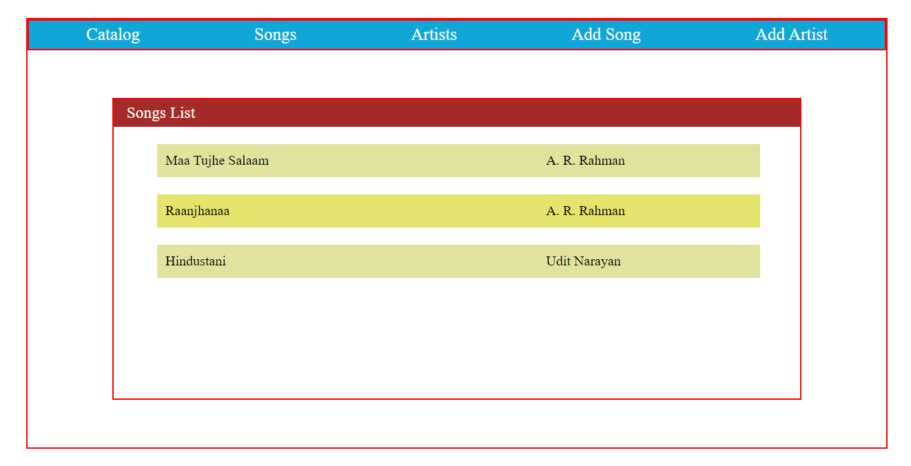
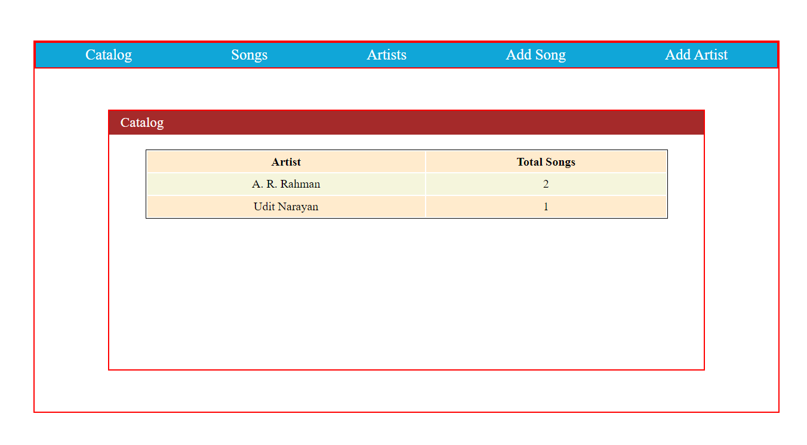
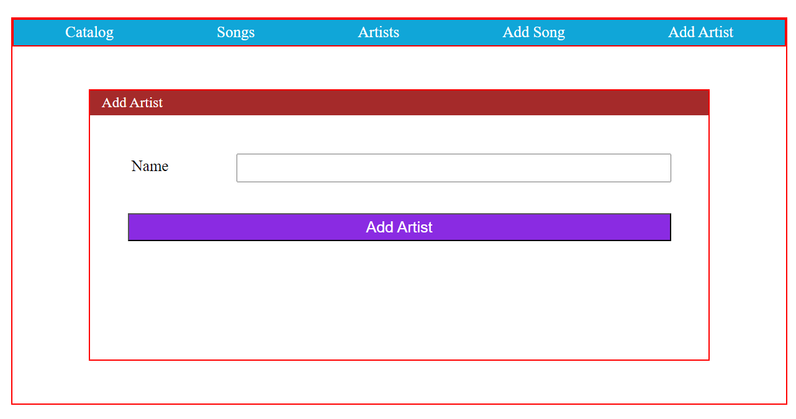
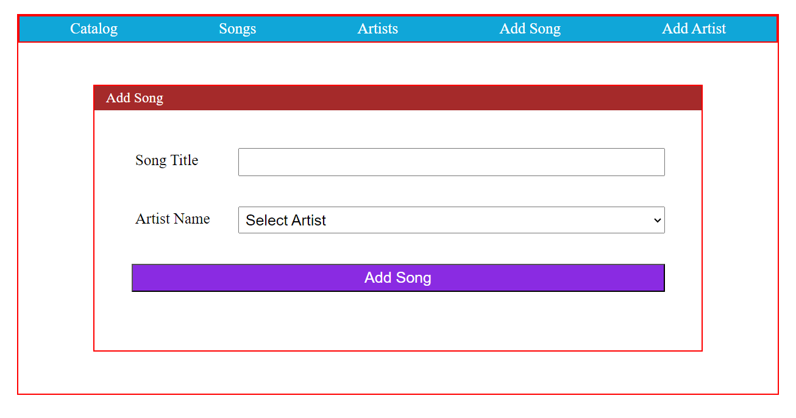
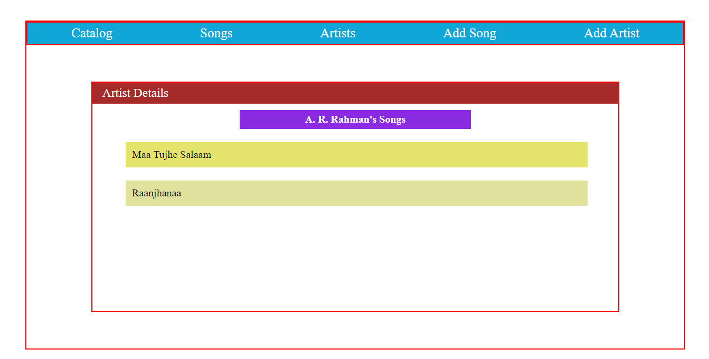

  <h3>Table of Contents:</h3>
  <ol>
    <li><a href="#inst">Installation</a></li>
    <li>
      <a href="#views">Views</a>
      <ul>
        <li><a href="#aview">View for Artists List</a></li>
        <li><a href="#sview">View for Songs List</a></li>
        <li><a href="#cview">View for Catalog</a></li>
        <li><a href="#nartist">View for Adding New Artist</a></li>
        <li><a href="#nsong">View for Adding New Song</a></li>
        <li><a href="#asong">View for Artist's Songs</a></li>
      </ul>
    </li>
    <li><a href="#tech">Tech Stack</a></li>
  </ol>
  <h3 id="inst">1.Installation:</h3>
  

    Clone the repository:
     
      &nbsp &nbsp &nbsp git clone https://github.com/buttaRahul/FavoriteTunes.git
     
    Navigate to the project directory:
     
      &nbsp &nbsp &nbsp cd FaviruteTunes
     
    Install dependencies:
      
     &nbsp &nbsp &nbsp pip install -r requirements.txt
      
    Apply migrations:
      
     &nbsp &nbsp &nbsp python manage.py migrate
      
    Create a superuser:
      
     &nbsp &nbsp &nbsp python manage.py createsuperuser
      
    Run the development server:
      
     &nbsp &nbsp &nbsp python manage.py runserver
     
  

  <h3 id="views">2.Views:</h3>
<!--   </img> -->

  <h5>View for Artists List</h5>
  

  <h5>View for Songs List</h5>
  

  <h5>View for Catalog</h5>
  

  <h5>View for Adding New Artist</h5>
  

  <h5>View for Adding New Song</h5>
  

  <h5>View for all Songs by Artist</h5>
  

  <h3 id="tech">3.Tech Stack:</h3> 
  <ul>
    <li>Python</li>
    <li>Django</li>
    <li>Template Inheritance</li>
    <li>HTML</li>
  </ul>

